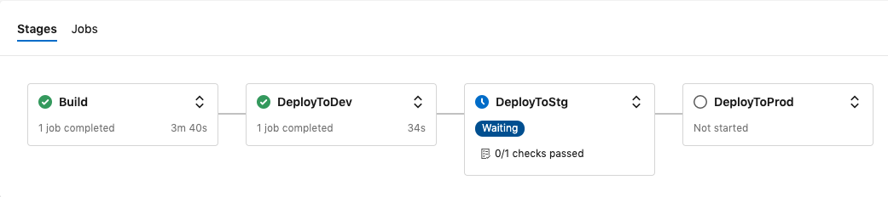

NOTICE: The contents of this repo was merged into [chef-cft/chef-examples](https://github.com/chef-cft/chef-examples/blob/master/examples/pipelines/PipelineOverview.md). This repo is archived.

# Azure DevOps pipelines for Habitat packages

## Introduction

Greetings! This repo contains two sample pipeline files for building and promoting [Habitat](https://www.habitat.sh) packages using [Azure DevOps](https://dev.azure.com). The pipelines are built using ADO's new [Multi-stage pipelines](https://devblogs.microsoft.com/devops/whats-new-with-azure-pipelines/).

## Components

While the pipelines are stored in a single `yml` file, there are really two main parts: Build and Deployment. The build tasks are handled in a single stage while the deployment tasks are broken into three separate stages. This gives us the ability to follow a standard `dev`, `stage`, `prod` deployment model.

The build stage is very simple. It uses the Habitat extension for almost all its steps. The three deployment stages only differ in one spot. The `DeployToDev` stage performs a `hab pkg upload...` while the `DeployToStg` and `DeployToProd` stages execute a `hab pkg promote ...` for their respective channels.

The pipelines are generic as they source the `last_build.ps1`/`last_build.env` files from the build. This allows us to pull the artifact name and the package identifier from the build.

## Usage

To consume these pipelines, copy the appropriate `yml` file from this repository into the root of your project. See my [Wildfly](https://github.com/jmassardo/wildfly) repo for an example. The Habitat extension expects the hab specific components to be in a `habitat/` subdirectory within your project.

For a step-by-step walk-through on setting up Azure DevOps pipelines, check out this [blog post](http://www.dxrf.com/blog/2019/09/27/Habitat-Pipelines-in-Azure-DevOps/).
